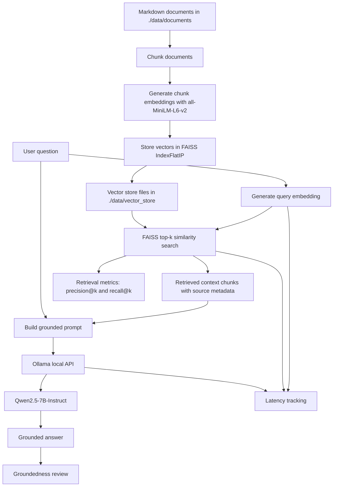

# RAG Pipeline Diagram

## Architecture

## Data Flow

1. Documents are stored as Markdown files in `./data/documents`.
2. `rag_pipeline.py prepare` loads the documents, chunks them, generates embeddings, and writes the FAISS index to `./data/vector_store`.
3. At query time, the user question is embedded with the same embedding model.
4. FAISS retrieves the top-k most similar chunks.
5. Retrieved chunks are formatted into a grounded prompt with source labels.
6. The prompt is sent to the local Ollama API using `qwen2.5:7b`.
7. The generated answer and retrieval outputs are evaluated with precision@k, recall@k, groundedness review, and latency measurements.

## Key Files

| File or Folder | Purpose |
|---|---|
| `./data/documents/` | Input Markdown documents |
| `./data/vector_store/` | Saved FAISS index, chunk metadata, and manifest |
| `./rag_pipeline.py` | RAG implementation |
| `./evaluate.py` | 10-question evaluation script |
| `./data/results/` | Evaluation outputs |
